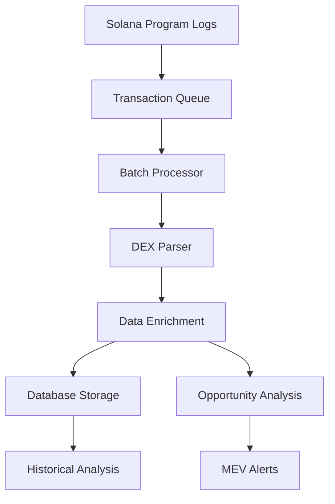

# Enhanced Real-Time Transaction Monitoring Service

## Overview

The Enhanced Transaction Monitoring Service provides comprehensive real-time monitoring of Solana DEX transactions with advanced parsing, efficient data storage, and intelligent MEV opportunity detection.

## 🚀 Key Features

### Real-Time Monitoring
- **Multi-DEX Support**: Monitors Raydium, Orca (Whirlpool & Legacy), and Serum DEX
- **WebSocket Connections**: Real-time subscription to Solana program logs
- **Batch Processing**: Efficient transaction processing with configurable batch sizes
- **Event-Driven Architecture**: Real-time events for swaps and MEV opportunities

### Advanced Transaction Parsing
- **DEX-Specific Parsers**: Tailored parsing for each DEX protocol
- **Token Metadata**: Automatic token symbol and decimal detection
- **Price Calculation**: Real-time price calculation with proper decimal adjustment
- **Volume Estimation**: USD volume estimation using SOL and USDC pricing

### Intelligent Data Storage
- **Optimized Schema**: Efficient storage in `dex_prices` table
- **Conflict Handling**: Duplicate transaction prevention
- **Indexed Queries**: Fast retrieval with strategic database indexes
- **Historical Analysis**: Long-term data retention for trend analysis

### MEV Opportunity Detection
- **Arbitrage Detection**: Cross-DEX price difference identification
- **Sandwich Opportunities**: Large transaction detection for front/back-running
- **Risk Assessment**: Execution risk scoring and profit estimation
- **Real-Time Alerts**: Immediate notification of profitable opportunities

## 📊 Performance Metrics

The service tracks comprehensive statistics:
- **Transactions Processed**: Total transaction count
- **Swaps Detected**: Successfully parsed swap transactions
- **Opportunities Found**: MEV opportunities identified
- **Error Tracking**: Failed transaction processing count

## 🔧 Configuration

### Batch Processing Settings
```javascript
batchSize: 50,          // Transactions per batch
batchTimeout: 1000,     // 1 second batch processing interval
```

### MEV Thresholds
```javascript
minArbitrageThreshold: 0.5%,    // Minimum profit for arbitrage
sandwichVolumeThreshold: $10,000, // Minimum volume for sandwich
profitThreshold: $0.01           // Minimum profit threshold
```

## 🏗️ Architecture

### Component Structure
```
EnhancedTransactionMonitor
├── SolanaService (WebSocket connections)
├── Batch Processor (Queue management)
├── DEX Parsers (Protocol-specific parsing)
├── Data Enrichment (Token metadata)
├── Storage Manager (Database operations)
└── Opportunity Analyzer (MEV detection)
```

### Data Flow


## 📡 API Endpoints

### Monitor Control
- `POST /api/monitor/start` - Start monitoring service
- `POST /api/monitor/stop` - Stop monitoring service
- `GET /api/monitor/stats` - Get real-time statistics

### Data Retrieval
- `GET /api/swaps` - Recent swap transactions
- `GET /api/opportunities` - MEV opportunities (with filters)
- `GET /api/prices/analysis` - Cross-DEX price analysis

### Query Parameters
```
/api/swaps?dex=raydium&limit=100
/api/opportunities?type=arbitrage&minProfit=0.01
/api/prices/analysis?tokenA=<mint>&tokenB=<mint>&timeframe=1h
```

## 🔍 Supported DEX Protocols

### Raydium AMM
- **Program ID**: `675kPX9MHTjS2zt1qfr1NYHuzeLXfQM9H24wFSUt1Mp8`
- **Features**: Swap parsing, liquidity pool detection, fee extraction
- **Data Extracted**: Token amounts, pool address, user authority

### Orca Whirlpool
- **Program ID**: `whirLbMiicVdio4qvUfM5KAg6Ct8VwpYzGff3uctyCc`
- **Features**: Concentrated liquidity parsing, tick data
- **Data Extracted**: Swap amounts, pool info, price impact

### Orca Legacy
- **Program ID**: `9W959DqEETiGZocYWCQPaJ6sBmUzgfxXfqGeTEdp3aQP`
- **Features**: Simple swap parsing, legacy pool support
- **Data Extracted**: Swap amounts, token pairs

### Serum DEX
- **Program ID**: `9xQeWvG816bUx9EPjHmaT23yvVM2ZWbrrpZb9PusVFin`
- **Features**: Order book trading, market making
- **Data Extracted**: Fill amounts, market address, prices

## 💾 Database Schema

### dex_prices Table
```sql
- dex_name: DEX identifier
- token_mint_a/b: Token mint addresses
- token_symbol_a/b: Human-readable symbols
- price: Calculated exchange rate
- volume_24h_usd: Estimated USD volume
- block_slot: Solana block slot
- timestamp: Transaction timestamp
- pool_address: DEX pool/market address
```

### mev_opportunities Table
```sql
- opportunity_type: 'arbitrage', 'sandwich'
- primary_dex/secondary_dex: DEX identifiers
- estimated_profit_sol: Profit estimation
- profit_percentage: Profit margin
- execution_risk_score: Risk assessment (1-10)
- status: 'detected', 'executed', 'expired'
```

## 🎯 MEV Detection Algorithms

### Arbitrage Detection
1. **Price Comparison**: Compare token prices across DEXs
2. **Time Window**: 2-minute window for price differences
3. **Profit Calculation**: Account for fees, slippage, gas costs
4. **Risk Assessment**: Market volatility and execution probability

### Sandwich Detection
1. **Volume Threshold**: Identify large transactions ($10k+)
2. **Slippage Estimation**: Calculate potential price impact
3. **Profit Estimation**: Front-run and back-run profit calculation
4. **Competition Analysis**: Assess MEV searcher competition

## 🚨 Real-Time Events

### Event Types
- `swapDetected`: New swap transaction parsed
- `opportunityDetected`: MEV opportunity identified

### Event Data
```javascript
// Swap Event
{
  signature: "5J7...abc",
  dex: "raydium",
  tokenSymbolA: "SOL",
  tokenSymbolB: "USDC",
  price: 104.50,
  volumeUSD: 1250.00
}

// Opportunity Event
{
  type: "arbitrage",
  profitPercent: 1.25,
  estimatedProfit: 0.0543,
  primaryDex: "raydium",
  secondaryDex: "orca"
}
```

## 📈 Performance Characteristics

### Throughput
- **Transaction Processing**: 50 transactions/second
- **Latency**: Sub-second detection and storage
- **Memory Usage**: Optimized caching and batch processing
- **Database Efficiency**: Indexed queries and bulk inserts

### Reliability
- **Error Handling**: Graceful failure recovery
- **Connection Management**: Automatic WebSocket reconnection
- **Data Integrity**: Transaction deduplication and validation
- **Monitoring**: Comprehensive logging and statistics

## 🔧 Deployment & Scaling

### Requirements
- Node.js 16+
- PostgreSQL 13+
- Solana RPC access (devnet/mainnet)
- Minimum 2GB RAM, 4GB recommended

### Scaling Considerations
- **Horizontal Scaling**: Multiple monitor instances
- **Database Sharding**: Time-based partitioning
- **Caching Layer**: Redis for hot data
- **Load Balancing**: Multiple RPC endpoints

## 🧪 Testing & Validation

### Test Coverage
- Unit tests for each DEX parser
- Integration tests for end-to-end flow
- Performance tests for high-volume scenarios
- Database stress testing

### Monitoring
- Real-time statistics dashboard
- Error rate monitoring
- Performance metrics tracking
- Database health monitoring

## 🚀 Future Enhancements

### Planned Features
- **Additional DEXs**: Jupiter, Aldrin, Mercurial
- **Advanced MEV**: Liquidation detection, flash loan opportunities
- **Machine Learning**: Predictive opportunity scoring
- **API Expansion**: GraphQL interface, WebSocket subscriptions

### Performance Improvements
- **Parallel Processing**: Multi-threaded transaction parsing
- **Caching Layer**: Redis for frequently accessed data
- **Compression**: Transaction data compression
- **Indexing**: Advanced database indexing strategies

---

## 📝 Quick Start

```bash
# Start the enhanced monitor
npm start

# Start monitoring
curl -X POST http://localhost:3001/api/monitor/start

# Check statistics
curl http://localhost:3001/api/monitor/stats

# View recent swaps
curl "http://localhost:3001/api/swaps?limit=20"

# Check opportunities
curl "http://localhost:3001/api/opportunities?type=arbitrage"
```

The Enhanced Transaction Monitoring Service provides a robust foundation for real-time MEV analysis on Solana, with the flexibility to scale and adapt to evolving DeFi protocols.